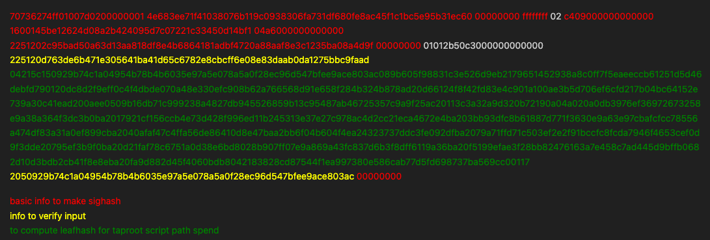

# Ledger's stradgey of psbt sign

```slasing psbt```



## Do not transfer entire psbt to firmware -- secure reason

 Transfer data only necessary and keep it minimal, under the parsing of TS SDK
 ```
 basic info: version/locktime
 input info: prevout hash/index/nSequ
 output info: scriptPubkey/amount
 ```
For common transaction, data above is enough to make sighash.

If taproot scriptpath, the **sighash** need input script leafhash
```
Using policy(descriptor+HMAC)

descriptor:
tr(@0/**,and_v(pk_k(@1/**),and_v(pk_k(@2/**),multi_a(6,@3/**,@4/**,@5/**,@6/**,@7/**,@8/**,@9/**,@10/**,@11/**))))"

HMAC
if (!is_standard_wallet_policy(...) && !verify_hmac(...)) {
    SEND_SW(dc, SW_SECURITY_POLICY_REJECTED);
    return;
}

```

## 2 verify input
For common transaction:
```
psbt info: in witness_utxo: scriptPubKey
xpub(fingerprint check, full derivation path) --> pubkey === scriptPubKey
```
## 3 verify output 

For common transaction:
```
outputs' scriptPubkey --> Address + amount --> show to users
users get these infomation from 2nd channel(DM,mail,phone,f2f) to confirm
NO TRUST WHAT SOFTWARE UI SHOWS BUT

ledger's screen === 2nd channel

```


